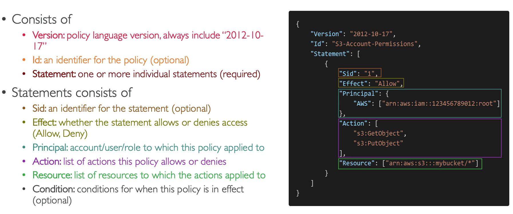
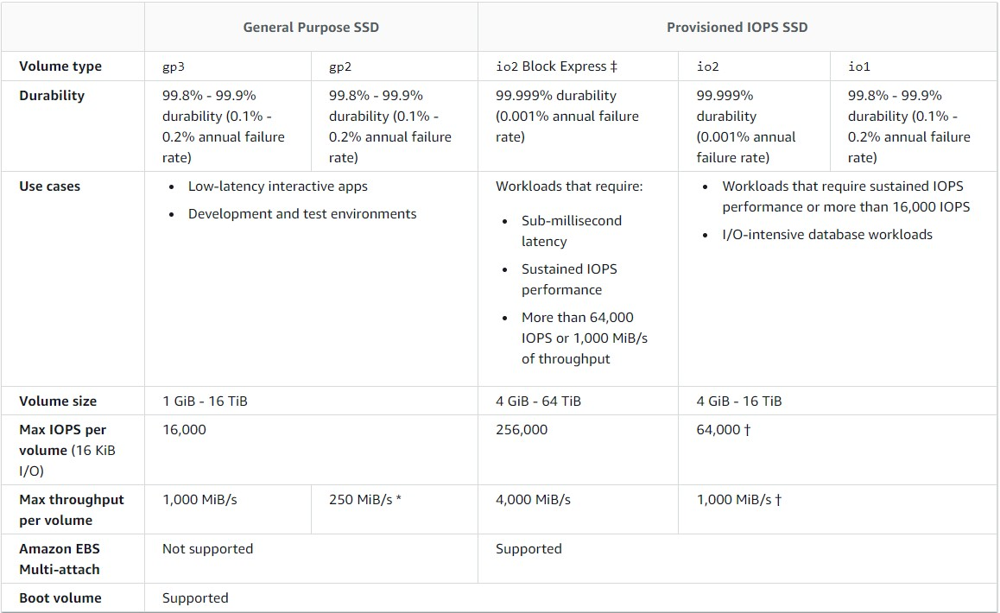

# WORK IN PROGRESS! AWS Solutions Architect Associate Certification - SAA-C02

Just some personal notes for the certification AWS SAA-C02

## Course Introduction

Measured exams skills and syllabus [here](doc/AWS-Certified-Solutions-Architect-Associate_Exam-Guide.pdf).

Exams sample questions [here](doc/AWS-Certified-Solutions-Architect-Associate_Sample-Questions.pdf).

## AWS Infrastructure

A **region** is a cluster of data centers. AWS has regions all around the world. They are connected through an AWS private network.

A common question can be: **"How to choose a Region?"**

You need to consider multiple aspects:

- Compliance: data never eaves a region without your explicit permission
- Proximity: proximity to customer to reduce latency
- Available services: some services/features may not be available in every Region
- Pricing: pricing varies region to region and it is transparent

An **AWS Availability Zones (AZ)** is a set of one or more data centers with redundant power, networking and connectivity.
Each region has *many* AZs usually 3, min is 2, max is 6. They are not known but they are separate from each other, thus isolated from disasters.
AZs in the same Regions are connected through high performance network.

For example in the *ap-southeast-2* AWS Region we can have the following three different AZs: *ap-southeast-2a*, *ap-southeast-2b*, *ap-southeast-2c*.

Finally, AWS has hundreds **Point of Presence** all around the world to provide lower latency to users.

## IAM Services

IAM is a Global service providign Identity and Access Management. A root account is created by default for each Organization (AWS account), this should not be shared or even used. First thing to do is to create **Users** which are people within your organization. Users can be grouped together into different **groups** (eg: Developers, Operations, etc.).

Users can belong to 0 (not a best practice) or multiple groups.

You can create Users and Groups to assign them permissions - attaching them JSON documents called **IAM Policies**. The suggested approach is to apply the **least privilege principle**: don't give more permissions than a user needs. Moreover, you should be aware that users inerhit all the permissions of their groups.

You can find an example of IAM Policies in the picture below.

In order to protect account's users you can enable:

- Password Policy
- Multi Factor Authentication (MFA)

Always protect root account.

Finally, IAM security tools enable you to revise and manage your IAM policies:

- IAM Credentials Report (Account-level) generates a report of all IAM users and the status of their various credentials.
- IAM Access Advisor (user-level) shows the service permissions granted to a user and when those services were last used.

### How can users access AWS?

To access AWS, you have 3 options:

- Management Console - protected by password & MFA
- CLI - protected by access keys
- Software Developer Kit (SDK) - for code: protected by access keys

Users manage their own access keys which are secret. Don't share Access Keys.

## Amazon EC2

Elastic Cloud Computing EC2 is one of the most popular of AWS' offering. AWS offers different types of instances:

- General Purpose: great for a diversity of workloads such as web servers or code repositories; great balance between compute, memory and network resources.
- Memory optimized: fast performance fow workloads that process large data sets in memory, such as in-memory databases, real time processing and distributed web scale cache stores.
- Storage Optimized: great for workloads that process large data sets in storage, such as data warehouses, distributed file systems and OLTP systems.
- Compute optimized: great for workloads which require high performance processors.

EC2 instances' has the following naming convention: *instance-class*_*generation*.*size-within-the-instance-class*; eg: m5.2xlarge.

### Introduction to Security Groups

Security Groups are the fundamental of network security in AWS: they are acting as a *firewall* on controlling how traffic is allowed into or out EC2 instances. Sec Groups **only contain allow rules** and can reference by IP addresses or by security group.

Security Groups can be attached to multiple instances and a single instance can have multiple Security Groups. Each Security Group is region/VPC scoped.

### Elastic IPs

By default an EC2 instance come with:

- a private IP address for the internal AWS network;
- a public IP for the Internet.

When you stop and start an EC2 instance, you lose the IP address. If you need to have a fixed public IP for your EC2 instance, you can use an **Elastic IP address**. You can assign an Elastic IP address to one EC2 instance at a time.
You can only have **5 Elastic IP** addresses in your account; even if you can ask AWS to increase that, it is not recommended. You should prefer DNS or Load Balancers services over Elastic IPs.

### Placement Groups

Sometimes you want control over EC2 Instance placement strategy, for example, you want to place your EC2 instances in different Availability Zones. That strategy can be defined by a **Placement Group**.

When you create a placement group, you can specify the following:

- **Cluster**: same rack and same AZ. Increase network performance.
- **Spread**: spread instances across different hardware and different AZs. Increase availability. Reduced network performance. Limited to 7 instances per AZ per placement group.
- **Partition**: you deploy instances in different partitions (rack). You can use up to 7 partitions per AZ and span across different AZs in the same region. Different partions do not share hardware.

### Elastic Netowrk Interfaces (ENI)

[ENI](https://aws.amazon.com/it/blogs/aws/new-elastic-network-interfaces-in-the-virtual-private-cloud/) is a network interface that is attached to an EC2 instance. It is a virtual network interface that is attached to an EC2 instance.
The ENI can have the following attributes:

- Primary private IP address (v4), 1+ secondary private IP addresses (v4)
- One Elastic IP address per IPv4
- One Public IP
- One or more security groups
- A MAC address

You can create ENI indipendently or you can move on the fly existing ENI to a different instance.
Note tha any ENIs are AZ scoped.

### EC2 Nitro

EC2 Nitro is the underlying platform for the next generation of EC2 instances. It is a new virtualization technology that provides a new level of performance and security:

- Better networking options (IPv6, HPC, etc)
- Higher speed EBS (max 32k EBS IOPS on non-nitro instances).

### AMI Overview

**Amazon Machine Image (AMI)** is a customization of an EC2 istance. You can add your own software, data, and configuration to an AMI. AMI ensures faster boot/configuration time because is all pre-packaged. AMI are region scoped and can be copied across regions.

You can launch EC2 instances from:

- a public AMI - AWS provided
- your own AMI - make and maintain yourself
- marketplace AMI - third party.

### Elastic Block Storage (EBS)

[**Amazon Elastic Block Store (EBS)**](https://docs.aws.amazon.com/AWSEC2/latest/UserGuide/AmazonEBS.html#ebs-features) provides block level storage volumes for use with EC2 instances. EBS volumes behave like raw, unformatted block devices. You can mount these volumes as devices on your instances. EBS volumes that are attached to an instance are exposed as storage volumes that persist independently from the life of the instance. You can create a file system on top of these volumes, or use them in any way you would use a block device (such as a hard drive). You can dynamically change the configuration of a volume attached to an instance.

The following is a summary of the use cases and characteristics of SSD-backed volumes. For information about the maximum IOPS and throughput per instance:

**EBS Multi-Attach** is a feature that allows you to attach multiple instances to a single EBS  volumes. Multi-attach is supported only from io1/io2 family of volumes. Each istance has full read&write access to all attached volumes. Best use case is to achieve higher application availability in clustered environments. Applications must manage concurrent write operations on the volumes. Volumes need to be formatted in a cluster-aware file system ()not XFS, EXT4, etc.).

When you create an encrypted volume, you get the following:

- Data at rest is encrypted inside the volume
- Data in transit is encrypted between the volume and the instance
- All snapshot are encrypted

Encryption has a minimal impact on latency. EBS encryption leverages keys from KMS (AES-256).

You can encrypt an unencrypted EBS volume with taking a snapshot, then encrypt the snapshot and then creating a new volume from the snapshot.

### Elastic File System (EFS)

EFS is a managed NFSv4 (network file system) that provides a file system that can be mounted on many EC2 across multi-AZ. It is highly available, scalable but is more expensive than EBS. However, it is pay per use.
You can attach a security group to an EFS instance and then **all linux based AMI (not Windows)** can access it.

### Amazon EC2 instance store

The last option to attach storage to an EC2 instance is the [**Amazon EC2 instance store**](https://docs.aws.amazon.com/AWSEC2/latest/UserGuide/InstanceStorage.html). This is a local disk that is attached to the instance. An instance store provides temporary block-level storage for your instance. This storage is located on disks that are physically attached to the host computer. Instance store is ideal for temporary storage of information that changes frequently, such as buffers, caches, scratch data, and other temporary content, or for data that is replicated across a fleet of instances, such as a load-balanced pool of web servers.

### High Availability and Scalability: ELB & ASG

[**Amazon Elastic Load Balancer (ELB)**](https://docs.aws.amazon.com/elasticloadbalancing/latest/userguide/what-is-elb.html) is a load balancer that provides high availability and scalability. It is a network service that provides a stable, reliable, and scalable way to distribute traffic across multiple EC2 instances.

[**Amazon Elastic Compute Cloud (EC2) Auto Scaling Groups (ASG)**](https://docs.aws.amazon.com/autoscaling/ec2/userguide/what-is-asg.html) is a service that provides automatic scaling for Amazon EC2 instances.
