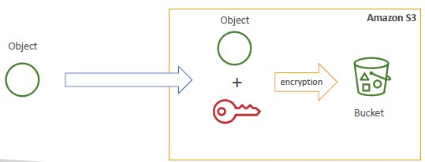
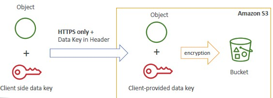
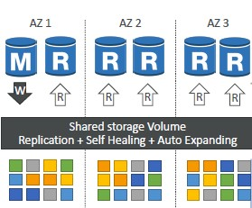

# 1. **WORK IN PROGRESS** AWS Solutions Architect Associate Certification - SAA-C02

Just some personal notes for the certification AWS SAA-C02

## 1.1. Course Introduction

Measured exams skills and syllabus [here](doc/AWS-Certified-Solutions-Architect-Associate_Exam-Guide.pdf).

Exams sample questions [here](doc/AWS-Certified-Solutions-Architect-Associate_Sample-Questions.pdf).

## 1.2. AWS Infrastructure

A **region** is a cluster of data centers. AWS has regions all around the world. They are connected through an AWS private network.

A common question can be: **"How to choose a Region?"**

You need to consider multiple aspects:

- Compliance: data never eaves a region without your explicit permission
- Proximity: proximity to customer to reduce latency
- Available services: some services/features may not be available in every Region
- Pricing: pricing varies region to region and it is transparent

An **AWS Availability Zones (AZ)** is a set of one or more data centers with redundant power, networking and connectivity.
Each region has *many* AZs usually 3, min is 2, max is 6. They are not known but they are separate from each other, thus isolated from disasters.
AZs in the same Regions are connected through high performance network.

For example in the *ap-southeast-2* AWS Region we can have the following three different AZs: *ap-southeast-2a*, *ap-southeast-2b*, *ap-southeast-2c*.

Finally, AWS has hundreds **Point of Presence** all around the world to provide lower latency to users.

## 1.3. IAM Services

IAM is a Global service providing Identity and Access Management. A root account is created by default for each Organization (AWS account), this should not be shared or even used. First thing to do is to create **Users** which are people within your organization. Users can be grouped together into different **groups** (e.g.: Developers, Operations, etc.).

Users can belong to 0 (not a best practice) or multiple groups.

You can create Users and Groups to assign them permissions - attaching them JSON documents called **IAM Policies**. The suggested approach is to apply the **least privilege principle**: don't give more permissions than a user needs. Moreover, you should be aware that users inherit all the permissions of their groups.

You can find an example of IAM Policies in the picture below.

In order to protect account's users you can enable:

- Password Policy
- Multi-Factor Authentication (MFA)

Always protect root account.

Finally, IAM security tools enable you to revise and manage your IAM policies:

- IAM Credentials Report (Account-level) generates a report of all IAM users and the status of their various credentials.
- IAM Access Advisor (user-level) shows the service permissions granted to a user and when those services were last used.

### 1.3.1. How can users access AWS?

To access AWS, you have 3 options:

- Management Console - protected by password & MFA
- CLI - protected by access keys
- Software Developer Kit (SDK) - for code: protected by access keys

Users manage their own access keys which are secret. Don't share Access Keys.

## 1.4. Amazon EC2

Elastic Cloud Computing EC2 is one of the most popular of AWS' offering. AWS offers different types of instances:

- General Purpose: great for a diversity of workloads such as web servers or code repositories; great balance between compute, memory and network resources.
- Memory optimized: fast performance for workloads that process large data sets in memory, such as in-memory databases, real time processing and distributed web scale cache stores.
- Storage Optimized: great for workloads that process large data sets in storage, such as data warehouses, distributed file systems and OLTP systems.
- Compute optimized: great for workloads which require high performance processors.

EC2 instances' has the following naming convention: *instance-class*_*generation*.*size-within-the-instance-class*; e.g.: m5.2xlarge.

### 1.4.1. Introduction to Security Groups

Security Groups are the fundamental of network security in AWS: they are acting as a *firewall* on controlling how traffic is allowed into or out EC2 instances. Sec Groups **only contain allow rules** and can reference by IP addresses or by security group.

Security Groups can be attached to multiple instances and a single instance can have multiple Security Groups. Each Security Group is region/VPC scoped.

### 1.4.2. Elastic IPs

By default, an EC2 instance come with:

- A private IP address for the internal AWS network;
- a public IP for the Internet.

When you stop and start an EC2 instance, you lose the IP address. If you need to have a fixed public IP for your EC2 instance, you can use an **Elastic IP address**. You can assign an Elastic IP address to one EC2 instance at a time.
You can only have **5 Elastic IP** addresses in your account; even if you can ask AWS to increase that, it is not recommended. You should prefer DNS or Load Balancers services over Elastic IPs.

### 1.4.3. Placement Groups

Sometimes you want control over EC2 Instance placement strategy, for example, you want to place your EC2 instances in different Availability Zones. That strategy can be defined by a **Placement Group**.

When you create a placement group, you can specify the following:

- **Cluster**: same rack and same AZ. Increase network performance.
- **Spread**: spread instances across different hardware and different AZs. Increase availability. Reduced network performance. Limited to 7 instances per AZ per placement group.
- **Partition**: you deploy instances in different partitions (rack). You can use up to 7 partitions per AZ and span across different AZs in the same region. Different partitions do not share hardware.

### 1.4.4. Elastic Network Interfaces (ENI)

[ENI](https://aws.amazon.com/it/blogs/aws/new-elastic-network-interfaces-in-the-virtual-private-cloud/) is a network interface that is attached to an EC2 instance. It is a virtual network interface that is attached to an EC2 instance.
The ENI can have the following attributes:

- Primary private IP address (v4), 1+ secondary private IP addresses (v4)
- One Elastic IP address per IPv4
- One Public IP
- One or more security groups
- A MAC address

You can create ENI independently or you can move on the fly existing ENI to a different instance.
Note that any ENIs are AZ scoped.

### 1.4.5. EC2 Nitro

EC2 Nitro is the underlying platform for the next generation of EC2 instances. It is a new virtualization technology that provides a new level of performance and security:

- Better networking options (IPv6, HPC.)
- Higher speed EBS (max 32k EBS IOPS on non-nitro instances).

### 1.4.6. AMI Overview

**Amazon Machine Image (AMI)** is a customization of an EC2 instance. You can add your own software, data, and configuration to an AMI. AMI ensures faster boot/configuration time because is all pre-packaged. AMI are region scoped and can be copied across regions.

You can launch EC2 instances from:

- a public AMI - AWS provided
- your own AMI - make and maintain yourself
- marketplace AMI - third party.

## 1.5. AWS Databases and Storage services

### 1.5.1. Elastic Block Storage (EBS)

[**Amazon Elastic Block Store (EBS)**](https://docs.aws.amazon.com/AWSEC2/latest/UserGuide/AmazonEBS.html#ebs-features) provides block level storage volumes for use with EC2 instances. EBS volumes behave like raw, unformatted block devices. You can mount these volumes as devices on your instances. EBS volumes that are attached to an instance are exposed as storage volumes that persist independently of the life of the instance. You can create a file system on top of these volumes, or use them in any way you would use a block device (such as a hard drive). You can dynamically change the configuration of a volume attached to an instance.

The following is a summary of the use cases and characteristics of SSD-backed volumes. For information about the maximum IOPS and throughput per instance:

**EBS Multi-Attach** is a feature that allows you to attach multiple instances to a single EBS volumes. Multi-attach is supported only from io1/io2 family of volumes. Each instance has full read&write access to all attached volumes. Best use case is to achieve higher application availability in clustered environments. Applications must manage concurrent write operations on the volumes. Volumes need to be formatted in a cluster-aware file system (not XFS, EXT4, etc.).

When you create an encrypted volume, you get the following:

- Data at rest is encrypted inside the volume
- Data in transit is encrypted between the volume and the instance
- All snapshot are encrypted

Encryption has a minimal impact on latency. EBS encryption leverages keys from KMS (AES-256).

You can encrypt an unencrypted EBS volume with taking a snapshot, then encrypt the snapshot and then creating a new volume from the snapshot.

### 1.5.2. Elastic File System (EFS)

EFS is a managed NFSv4 (network file system) that provides a file system that can be mounted on many EC2 across multi-AZ. It is highly available, scalable but is more expensive than EBS. However, it is pay per use.
You can attach a security group to an EFS instance and then **all Linux based AMI (not Windows)** can access it.

### 1.5.3. Amazon EC2 instance store

The last option to attach storage to an EC2 instance is the [**Amazon EC2 instance store**](https://docs.aws.amazon.com/AWSEC2/latest/UserGuide/InstanceStorage.html). This is a local disk that is attached to the instance. An instance store provides temporary block-level storage for your instance. This storage is located on disks that are physically attached to the host computer. Instance store is ideal for temporary storage of information that changes frequently, such as buffers, caches, scratch data, and other temporary content, or for data that is replicated across a fleet of instances, such as a load-balanced pool of web servers.

## 1.6. Amazon S3

Amazon S3 allows you to store objects (files) in **buckets** (directories). Buckets must have a globally unique name and they are defined at the regional level.

Each object has a key (name) and a value (content) is the **full path** to the file, e.g.: s3://my-bucket/myfile.txt. Object values are the content of the body. Object max size is **5 TB** but to upload more than 5 GB you must use the **multipart** upload feature. Each object can have metadata, tags and version ID (if enabled).

Versioning is enabled at the **bucket level**. Enabling versioning is a best practice and it protects you against unintended deletes and provides you easy roll back to previous versions. Note that any file not versioned prior to enabling versioning will have version `null`. Suspending versioning on a bucket does not delete the previous versions.

S3 is **strong consistent**: after a successful write or overwrite or delete operation any subsequent read or list request will return the latest version of the object.

### 1.6.1. S3 Encryption

There are 4 methods to encrypt objects in S3:

- SSE-S3: Server Side Encryption with S3-Managed Keys - HTTP/HTTPS with header `x-amz-server-side-encryption:AES256`.
- SSE-KMS: server side encryption with KMS - HTTP/HTTPS with header `x-amz-server-side-encryption:aes:kms`.
- SSE-C: server side encryption with customer keys not stored on AWS - only HTTPS is supported.
- CSE: Client side encryption - client store encrypted data to S3 buckets, also decryption is client side. You can leverage AWS provided library to encrypt/decrypt data.

SSE-S3 and SSE-KMS can be thought as the following:

and SSE-C as follows:

.

One way to force encryption is to use bucket policy and refuse any API call to PUT an S3 object without encryption headers. Another way is to enable **default encryption** option in S3. Note that bucket policies are evaluated before default encryption.

### 1.6.2. S3 Security and CORS

When an S3 bucket is published as website you may need to enable [CORS](https://docs.aws.amazon.com/AmazonS3/latest/userguide/cors.html) on the *destination* bucket.

### 1.6.3. S3 Replication

You can enable Cross Region Replication (**CRR**) and Same Region Replication (**SRR**) on S3 buckets. This allows you to replicate data from one region to another no matter the account owner. Copy is async. Replication is **not retroactive**, only new objects will be replicated. You can not chain replication.

Note that versioning needs to be enabled on the source and destination bucket to enable replication.

You can use CRR to meet compliance standard, gain lower latency access or replication across accounts.
You can use SRR for example for log aggregation or for live replication between production and test accounts.

You can use S3 **[pre-signed URLs](https://docs.aws.amazon.com/AmazonS3/latest/userguide/ShareObjectPreSignedURL.html)** to give temporary access to an object.

### 1.6.4. S3 Storage Classes and Glacier

S3 provides different storage classes:

- **Standard**
  - default storage class
  - high durability per year of objects across multiple AZ
  - 99,99% availability
  - Sustain 2 concurrent facility failure
- **Standard-Infrequent Access (IA)**
  - Suitable for data that is accessed infrequently but requires rapid access when needed
  - same durability
  - 99,9% availability
  - Sustain 2 concurrent facility failure
  - Low cost compared to standard
- **One Zone Infrequent Access (IA-1)**
  - Same as IA but in a single AZ
  - high durability
  - 99,95% availability
  - 20% lower cost than IA
- **Intelligent Tiering**
  - small monthly monitoring and auto-tiering fee
  - automatically moves objects to the most cost-effective storage class between general and IA
  - High durability
  - 99,9% availability
  - resilient against events that impact an entire AZ
- **Glacier**
  - Low cost storage for long-term archival (10s of years)
  - Alternative to on-premise magnetic tape storage
  - High annual durability
  - You are charged for storage and retrieval fees
  - Each item is called Archive and archives are stored in Vaults
  - retrieval is not immediate - different retrieval options (expedited, standard or bulk)
  - minimum storage duration of 90 days
- **Glacier Deep Archive**
  - long term storage with longer retrieval time
  - cheaper
  - minimum storage duration of 180 days

Further details [here](https://aws.amazon.com/s3/storage-classes/?nc1=h_ls)

### 1.6.5. S3 Lifecycle rules

You can enable actions to manage your objects based on tags or prefixes:

- **Expiration**: delete object or older version after a period of time
- **Transition**: change the storage class of an object after a period of time

## 1.7. Databases in AWS

**Relational Database Service RDS** is a managed relational database service that provides high-performance, highly available, and scalable relational databases. It allows creating databases that are managed by AWS. It offers the following engines:

- Postgres
- MySQL
- MariaDB
- Oracle
- Microsoft SQL Server
- Aurora (AWS proprietary DB)

RDS provides you:

- Provisioning and OS patching
- Continuous backups and Point in Time restore - daily full backup and transaction logs are backed-up every 5 minutes (retention between 7 and 35 days)
- DB Snapshot (different from backups, snapshots are triggered by the user and retention is arbitrary)
- Monitoring dashboard
- Read replicas for improved performance
- Multi AZ setup for Disaster Recovery
- scaling capabilities (vertical and horizontal)

However, you can not SSH the instance.

### 1.7.1. RDS Read Replicas

In order to improve performance you can enable **RDS Read Replicas**. It allows you to create up to 5 read replicas of an RDS instance within AZ, Cross AZ or Cross Region. Replication is ASYN so reads are **eventually consistent**. You can promote replicas to their own DB.

Usually in AWS there is a network cost when data goes from one AZ to another but, for RDS Read Replicas **within the same region** you are not overcharged. If you are using a cross region replicas you are charged for the transfer of data between the two regions.

Note that applications must update the connection string to leverage read replicas.

### 1.7.2. RDS Multi AZ

To provide disaster recovery you can use RDS Multi AZ. It allows you to create a single RDS instance in multiple AZs. This is useful when you need to provide high availability for your RDS instance. In this scenario RDS leverages a SYNC replication model. Using a single DNS name to access the RDS instance provide automatic app failover to standby.

This is not intended for scaling as the standby instance are not accessible.

### 1.7.3. RDS Encryption

You can enable at rest and in-flight encryption for RDS.

At rest encryption has to be defined at launch time. Note **that if the master is not encrypted, the read replicas cannot be encrypted**. TDE available only for SQLs server and Oracle.

Moreover, snapshots of (un-)encrypted RDS are (not) encrypted. You can copy an unencrypted snapshot into an encrypted one and vice-versa. To encrypt an unencrypted snapshot you need to create a new snapshot, copy the snapshot and enable encryption for the new snapshot, then restore the database from the snapshot and finally migrate applications to the new database.

### 1.7.4. RDS Security

RDS databases are usually deployed within a **private subnet**, not in a public one. You can use **security groups** to control access to the database.

IAM helps to control who can manage AWS RDS.

To sum up:

Your responsibility in AWS RDS:

- Check the ports / IP / security group inbound rules in DB’s SG
- In-database user creation and permissions or manage through IAM
- Creating a database with or without public access
- Ensure parameter groups or DB is configured to only allow SSL connections

AWS responsibility:

- No SSH access
- No manual DB patching
- No manual OS patching
- No way to audit the underlying instance

### 1.7.5. Amazon Aurora

Aurora is a proprietary technology from AWS (not open sourced) but Postgres and MySQL are both supported as Aurora DB (that means your drivers will work as if Aurora was a Postgres or MySQL database). Aurora is **AWS cloud optimized** and claims **5x** performance improvement over MySQL on RDS, over **3x** the performance of Postgres on RDS. Aurora storage automatically grows in increments of 10 GB, up to 64 TB.  Aurora can have 15 replicas while MySQL has 5, and the replication process is faster (sub 10 ms replica lag). Failover in Aurora is instantaneous. It’s **HA native**. Aurora costs more than RDS (20% more) – but is more efficient. Aurora stores **6 copies** of your data across **3 AZs**:

- 4 copies out of 6 needed for writes
- 3 copies out of 6 needed for reads
- Self healing with p2p replication
- storage is striped across 100s of volumes
- autoscaling

Remember the picture below:

At each point in time, Aurora has a primary and 1+ secondary. The primary is the primary copy of the data. The secondary is the copy that is used for reads. The primary is the only copy that is written to. You have a DNS name for writes on the primary and a different one (connection load balancing) for reads on the secondary.
You can create custom endpoints pointing to a subset of the replicas.

Aurora security is pretty the same of RDS.

Aurora supports **Multi-Master** topology in case you want immediate failover for write node. Every node does RW instead promoting a RR (read replica) as the new master.

### 1.7.6. Amazon ElastiCache

ElastiCache is a managed cache service that provides high-performance, high-capacity, and cost-effective caching for Memcached and Redis.
Caches are in-memory databases with really high performance and low latency. It is used to store data that is frequently accessed, but is not stored in a long-term consistent storage. It helps to make your applications stateless.

AWS takes care of OS maintenance/patching, optimizations, setup, configuration, monitoring, failure recovery and backups.

Main differences between RDS and ElastiCache important to know are the following.
Redis:

- Multi AZ with Auto-Failover
- Read Replicas to scale reads and have high availability
- Data Durability using AOF persistence
- Backup and restore features

Memcached:

- Multi-node for partitioning of data (sharding)
- No high availability (replication)
- Non-persistent
- No backup and restore
- Multi-threaded architecture

## 1.8. High Availability and Scalability: ELB & ASG

[**Amazon Elastic Load Balancer (ELB)**](https://docs.aws.amazon.com/elasticloadbalancing/latest/userguide/what-is-elb.html) is a load balancer that provides high availability and scalability. It is a network service that provides a stable, reliable, and scalable way to distribute traffic across multiple EC2 instances.

[**Amazon Elastic Compute Cloud (EC2) Auto Scaling Groups (ASG)**](https://docs.aws.amazon.com/autoscaling/ec2/userguide/what-is-asg.html) is a service that provides automatic scaling for Amazon EC2 instances.

## 1.9. Amazon Route 53

Amazon Route 53 is a 100% available, scalable, fully managed and **authoritative** DNS service. Route 53 is a domain registrar as well.

See [official documentation](https://aws.amazon.com/it/route53/features/) for details

## 1.10. Decoupling Applications

When you deploy multiple applications they will need to communicate each other. There are two patterns of application communication:

- synchronous: application to application
- asynchronous: application to queue to application

Synchronous communication between application can be problematic, it's better to decouple your applications:

- SQS: queue model
- SNS: pub/sub model
- Kinesis: real-time streaming model

### 1.10.1. SQS

SQS it's a queue model. It's a simple queue that can be used to communicate between applications.

You can have multiple **producers** that create messages and send them to the queue and then you can have different **consumers** that consume/poll messages from the queue. Message is persisted in SQS until a consumer deletes it.

SQS is a fully managed service with the following features:

- unlimited throughput: unlimited number of messages in queue
- default retention of messages: 4 days, maximum is 14 days
- low latency
- message sent lower than 256kb
- Can have duplicate messages
- Can have out of order messages

SQS provides **in-flight encryption** using HTTPS API and **at-rest encryption** using KMS and client-side encryption. Moreover you can control accesses through **IAM Policies** and SQS Access Policies (similar to S3 bucket policies).
